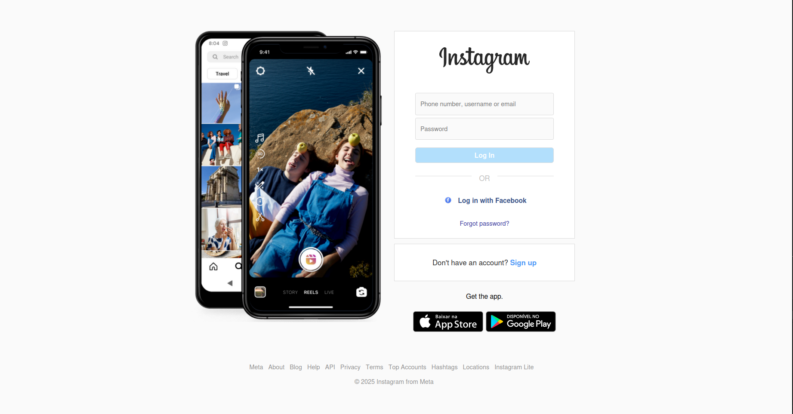

# Instagram Login Page Clone 📱

A visually faithful and responsive clone of the Instagram login page, created for front-end development studies using pure HTML5 and CSS3.

---

## 📋 Table of Contents

- [About The Project](#📝-about-the-project)
- [🛠️ Tech Stack](#️-tech-stack)
- [🚀 Getting Started](#-getting-started)
  - [Prerequisites](#prerequisites)
  - [Installation](#installation)
- [📸 Screenshot](#-screenshot)
- [📬 Contact](#-contact)

---

## 📝 About The Project

This project was developed as a personal challenge to practice and enhance front-end skills. The main goal was to replicate the Instagram login page with high visual fidelity, focusing on a clean HTML structure and a responsive layout built entirely with CSS, without relying on any frameworks.

It serves as a demonstration of proficiency in:
* Semantic HTML5 markup.
* Advanced CSS styling and layout techniques (Flexbox/Grid).
* Creating responsive designs that adapt to both mobile and desktop screens.

---

## 🛠️ Tech Stack

This project was built using the following technologies:

- **Core Technologies:**
  - [HTML5](https://developer.mozilla.org/en-US/docs/Web/Guide/HTML/HTML5)
  - [CSS3](https://developer.mozilla.org/en-US/docs/Web/CSS)

- **Development Tools:**
  - [Visual Studio Code](https://code.visualstudio.com/)

---


## 🚀 Getting Started

To get a local copy up and running, follow these simple steps.

### Prerequisites

You only need a few basic tools to view or edit the project.
* A modern **Web Browser** (e.g., Google Chrome, Firefox, Safari, or Edge).
* A **Code Editor** of your choice (like VS Code) if you wish to inspect or modify the code.

### Installation

1.  **Clone the repository**
    ```sh
    git clone https://github.com/thiagobraga77/Insta
    ```
    

2.  **Navigate to the project directory**
    ```sh
    cd Instagram
    ```

3.  **Open the page**
    Simply open the `index.html` file in your web browser. You can do this by double-clicking the file in your file explorer.

And that's it! The page will be displayed locally in your browser.

---

## 📸 Screenshot

Here is a preview of the final project on a desktop screen:




---

## 📬 Contact

[Thiago Braga] - [thiagobraga2a@gmail.com](thiagobraga2a@gmail.com)

Project Link: [ https://github.com/thiagobraga77/Insta]( https://github.com/thiagobraga77/Insta)


